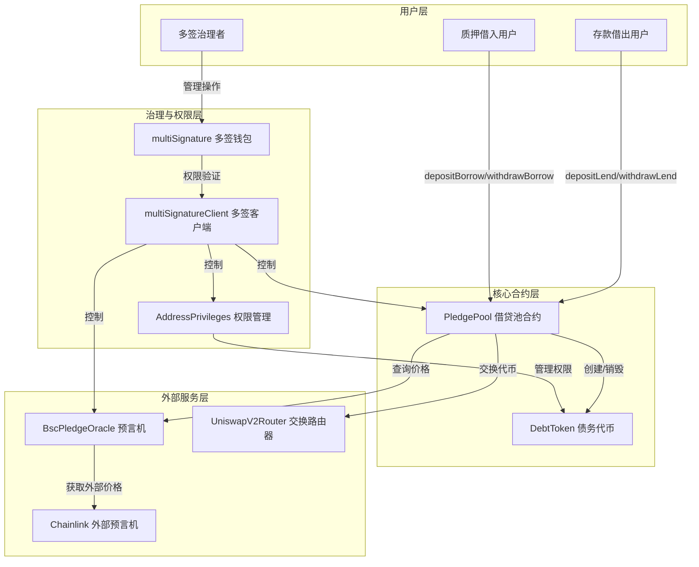

# MetaNodePledge

Pledge是一个基于区块链技术的去中心化借贷质押平台，允许用户通过质押资产进行借贷操作，并提供自动清算机制确保系统安全。项目采用多签治理模式，确保关键操作的安全性和去中心化特性

## 系统架构图

### 1、架构层次说明

```
┌─────────────────────────────────────────────────────────────────┐
│                          用户层                                  │
├─────────────────────────────────────────────────────────────────┤
│  • 存款借出用户 (Lender)                                          │
│  • 质押借入用户 (Borrower)                                        │
│  • 多签治理者(Governance)                                         │
└─────────────────────────────────────────────────────────────────┘
                              ↓
┌─────────────────────────────────────────────────────────────────┐
│                       核心合约层                                  │
├─────────────────────────────────────────────────────────────────┤
│  • PledgePool - 借贷池合约（核心业务逻辑)                           │
│  • DebtToken - 债务代币（记录借贷关系）                             │
└─────────────────────────────────────────────────────────────────┘
                              ↓
┌─────────────────────────────────────────────────────────────────┐
│                      治理与权限层                                 │
├─────────────────────────────────────────────────────────────────┤
│  • multiSignature - 多签钱包                                     │
│  • multiSignatureClient - 多签客户端                             │
│  • AddressPrivileges - 权限管理                                  │
└─────────────────────────────────────────────────────────────────┘
                              ↓
┌─────────────────────────────────────────────────────────────────┐
│                       外部服务层                                  │
├─────────────────────────────────────────────────────────────────┤
│  • BscPledgeOracle - 预言机服务                                   │
│  • UniswapV2Router - 代币交换路由器                               │
│  • Chainlink - 外部价格数据源                                     │
└─────────────────────────────────────────────────────────────────┘
```

### 2、主要交互流程

**用户操作流程：**

- 📥 **存款借出用户** → `depositLend()` / `withdrawLend()` → PledgePool
- 📤 **质押借入用户** → `depositBorrow()` / `withdrawBorrow()` → PledgePool
- 🔐 **多签治理者** → 管理操作 → MultiSig → MultiSigClient

**合约交互流程：**

- PledgePool ↔️ DebtToken（创建/销毁债务代币）
- PledgePool → Oracle（查询资产价格）
- PledgePool → SwapRouter（执行代币交换）
- Oracle → Chainlink（获取外部价格数据）

**权限控制流程：**

- MultiSigClient → PledgePool（控制核心合约）
- MultiSigClient → Oracle（控制预言机）
- MultiSigClient → AddressPrivileges（管理权限）
- AddressPrivileges → DebtToken（权限管理）


### 3、完整架构图



## 版本历史

### v0.4.0 (2025-11-14) 新增DebtToken代币合约

- 💰 **DebtToken 债务代币合约**
  - ✨ 继承 ERC20 标准，实现债务代币功能
  - 🔐 仅 Minter 可铸造/销毁代币
  - 🛡️ 集成 AddressPrivileges 权限管理
  - ✅ 完整的单元测试（11 个测试用例全部通过）

### v0.3.0 (2025-11-14) 新增AddressPrivileges权限管理合约

- 🔐 **AddressPrivileges 权限管理合约**
  - ✨ 实现 Minter（铸币者）角色管理功能
  - 🛡️ 继承 MultiSigClient，所有权限操作需多签批准
  - 📝 支持添加/删除 Minter，查询 Minter 列表
  - ✅ 完整的单元测试覆盖（包含多签集成测试）
- 📚 **核心概念**
  - 💡 Minter：有权铸造和销毁代币的合约地址（如借贷池）
  - 🔗 为后续 DebtToken 和 PledgePool 奠定基础

### v0.2.0 (2025-11-13) 新增MultiSignatureV2多签合约

- 🚀 **多签架构重构 (MultiSignatureV2)**
  - ✨ 采用验证中心 + 客户端分离架构，职责更清晰
  - 🏦 新增 `MultiSigWallet` 作为独立的签名验证中心
  - 🛡️ 新增 `MultiSigClient` 基类，提供 `validCall` 修饰器
  - 🔌 业务合约通过继承 `MultiSigClient` 即可获得多签保护能力
- ⚡ **性能优化**
  - 📊 使用 hash 索引替代数组遍历，节省 30-40% Gas
  - 🎯 简化调用流程：从 3 步操作简化为 1 步调用
- 🔐 **安全性增强**
  - ✅ 添加重复签名检查，防止签名混淆
  - 🔒 框架级防护，自动处理重复执行风险
  - 💾 采用 EIP-1967 槽位模式，避免存储冲突
- 📚 **工具库优化**
  - 🔧 新增 `AddressArrayLib` 地址数组工具库
  - ✨ 支持自动去重、快速查找等功能
- 🧪 **测试完善**
  - 📝 新增 `MockMultiSigClient` 测试合约
  - ✅ 完整的单元测试覆盖

### v0.1.0 (2025-11-11) 新增MultiSignatureV1多签合约

- ✨ 新增多签钱包合约 (MultiSignatureV1)，支持多方确认交易
- 🔐 实现提交、确认、撤销、执行交易完整流程
- 📝 支持纯转账和合约调用两种交易模式