# MetaNodePledge

Pledge是一个基于区块链技术的去中心化借贷质押平台，允许用户通过质押资产进行借贷操作，并提供自动清算机制确保系统安全。项目采用多签治理模式，确保关键操作的安全性和去中心化特性

## 系统架构图

### 1、架构层次说明

```
┌─────────────────────────────────────────────────────────────────┐
│                          用户层                                  │
├─────────────────────────────────────────────────────────────────┤
│  • 存款借出用户 (Lender)                                          │
│  • 质押借入用户 (Borrower)                                        │
│  • 多签治理者(Governance)                                         │
└─────────────────────────────────────────────────────────────────┘
                              ↓
┌─────────────────────────────────────────────────────────────────┐
│                       核心合约层                                  │
├─────────────────────────────────────────────────────────────────┤
│  • PledgePool - 借贷池合约（核心业务逻辑)                           │
│  • DebtToken - 债务代币（记录借贷关系）                             │
└─────────────────────────────────────────────────────────────────┘
                              ↓
┌─────────────────────────────────────────────────────────────────┐
│                      治理与权限层                                 │
├─────────────────────────────────────────────────────────────────┤
│  • multiSignature - 多签钱包                                     │
│  • multiSignatureClient - 多签客户端                             │
│  • AddressPrivileges - 权限管理                                  │
└─────────────────────────────────────────────────────────────────┘
                              ↓
┌─────────────────────────────────────────────────────────────────┐
│                       外部服务层                                  │
├─────────────────────────────────────────────────────────────────┤
│  • BscPledgeOracle - 预言机服务                                   │
│  • UniswapV2Router - 代币交换路由器                               │
│  • Chainlink - 外部价格数据源                                     │
└─────────────────────────────────────────────────────────────────┘
```

### 2、主要交互流程

**用户操作流程：**

- 📥 **存款借出用户** → `depositLend()` / `withdrawLend()` → PledgePool
- 📤 **质押借入用户** → `depositBorrow()` / `withdrawBorrow()` → PledgePool
- 🔐 **多签治理者** → 管理操作 → MultiSig → MultiSigClient

**合约交互流程：**

- PledgePool ↔️ DebtToken（创建/销毁债务代币）
- PledgePool → Oracle（查询资产价格）
- PledgePool → SwapRouter（执行代币交换）
- Oracle → Chainlink（获取外部价格数据）

**权限控制流程：**

- MultiSigClient → PledgePool（控制核心合约）
- MultiSigClient → Oracle（控制预言机）
- MultiSigClient → AddressPrivileges（管理权限）
- AddressPrivileges → DebtToken（权限管理）


### 3、完整架构图

```mermaid
flowchart TD
    subgraph "用户层"
        Lender["存款借出用户"]
        Borrower["质押借入用户"]
        Governance["多签治理者"]
    end

    subgraph "核心合约层"
        PledgePool["PledgePool 借贷池合约"]
        DebtToken["DebtToken 债务代币"]
    end

    subgraph "治理与权限层"
        MultiSig["multiSignature 多签钱包"]
        MultiSigClient["multiSignatureClient 多签客户端"]
        AddressPrivileges["AddressPrivileges 权限管理"]
    end

    subgraph "外部服务层"
        Oracle["BscPledgeOracle 预言机"]
        SwapRouter["UniswapV2Router 交换路由器"]
        Chainlink["Chainlink 外部预言机"]
    end

    Lender -->|depositLend/withdrawLend| PledgePool
    Borrower -->|depositBorrow/withdrawBorrow| PledgePool
    Governance -->|管理操作| MultiSig
    MultiSig -->|权限验证| MultiSigClient
    MultiSigClient -->|控制| PledgePool
    MultiSigClient -->|控制| Oracle
    MultiSigClient -->|控制| AddressPrivileges
    PledgePool -->|创建/销毁| DebtToken
    PledgePool -->|查询价格| Oracle
    PledgePool -->|交换代币| SwapRouter
    Oracle -->|获取外部价格| Chainlink
    AddressPrivileges -->|管理权限| DebtToken
```

